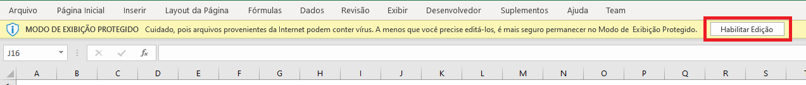
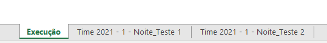
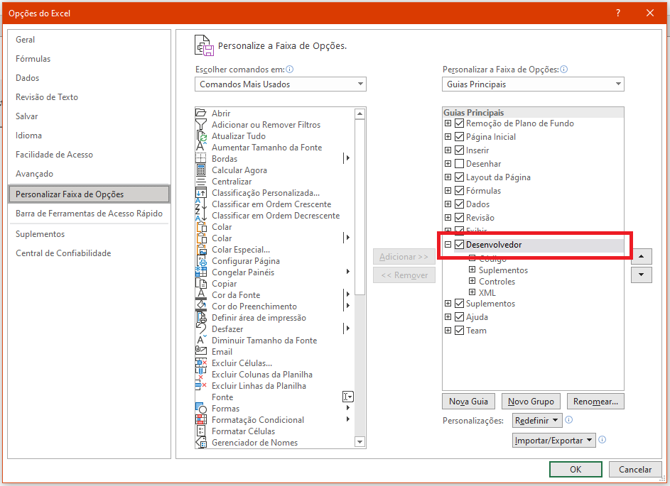
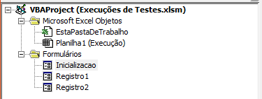

# Testes de Hardware

> Os testes de hardware implementados para o projeto Fatequino consistem na verificação da movimentação do robô.
A Proposta de testes para a movimentação do robô Fatequino consiste na verificação de sua capacidade de locomoção e detecção com base em 6 percursos preestabelecidos, cada um com diferentes objetivos e graus de dificuldade.

* O primeiro percurso tem como objetivo a verificação da capacidade do robô em seguir uma linha guia;

* O segundo percurso tem como objetivo a verificação da capacidade do robô em detectar um obstáculo em seu trajeto e realizar a parada, impedindo a colisão;

* O terceiro percurso tem como objetivo verificar gradualmente a capacidade do robô em realizar curvas exigidas em seu trajeto. Iniciando pela avaliação sobre uma curva em ângulo obtuso (135°)

* O quarto percurso tem como objetivo verificar gradualmente a capacidade do robô em realizar curvas exigidas em seu trajeto. Iniciando pela avaliação sobre uma curva em ângulo obtuso (90°);

* O quinto percurso tem como objetivo verificar gradualmente a capacidade do robô em realizar curvas exigidas em seu trajeto. Iniciando pela avaliação sobre uma curva em ângulo obtuso (45°);

* O primeiro percurso tem como objetivo verificar a capacidade do robô em desviar de um obstáculo em seu caminho, retornar ao trajeto e concluí-lo.

## Plataforma de Registro 

Com o intuito de garantir a padronização dos registros de testes a serem efetuados, foi desenvolvida uma plataforma intermediária, por onde as execuções de testes serão adicionadas a uma planilha única.

Esta plataforma foi desenvolvida na linguagem VBA (Visual Basic for Applications) e está atrelada a uma planilha Excel, na qual serão armazenadas as execuções de testes e pode ser encontrada no arquivo <a href="Execuções de Testes.xlsm">Execuções de Testes.xlsm</a>.

- ### Instalação

Para utilizar a plataforma de registros deve ser reallizado o download do arquivo <a href="Execuções de Testes.xlsm">Execuções de Testes.xlsm</a>. Ao acessar o arquivo pode ser necessária a habilitação da edição do conteúdo, que deve ser confirmada caso seja exibida a mensagem abaixo, pressionando o botão "Habilitar Edição".

   

Outra configuração que pode ser necessária é em relação à habilitação do funcionamento das macros (funções prógramadas da planilha excel).
Caso seja exibido o aviso abaixo, deve ser pressionado o botão indicado "Habilitar Conteúdo".

   

- ### Utilização

Após o final da configuração, a plataforma pode ser acessada por meio do botão "Registrar nova execução de testes" e os registros já realizados podem ser consultados através das abas da planilha. Conforme imagem abaixo.

    

**Obs.: ** Para o perfeito funcionamento da plataforma, devem ser baixados também os PDF's de tutorial presentes no arquivo [Tutoriais.zip](Tutoriais.zip). Ainda para garantir o funcionamento, os arquivos devem ser mantidos no mesmo diretório em que se encontrar a planilha.

- ### Modificação

Para realizar o acesso ao código da plataforma é necessário que se obtenha a aba "Desenvolvedor" na faixa de opções do Excel.

  

Caso esta aba não esteja disponível ela pode ser liberada através da seguinte configuração:
- Arquivos > Opções > Personalizar Faixa de Opções - Selecionar a caixa de seleção "Desenvolvedor"

  

Com a aba Desenvolvedor habilitada, através da opção "Visual Basic", a primeira da aba, pode ser acessada a área de desenvolvimento do Microsoft Excel, na qual estarão presentes os designs dos formulários e seus respectivos códigos. Na sessão Projeto podem ser visualizados os formulários "Inicializacao", "Registro 1" e "Registro 2". 

  

- Com duplo clique em seus nomes será exibido o layout dos formulários e as opções de configuração.
- Pressionando a tecla F7 será exibido o código comentado referente ao formulário aberto.
